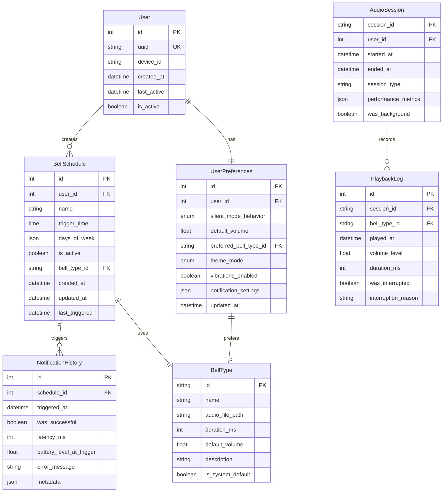

# Data Model: React Native + Rust Bell Notification App

**Date**: 2025-01-24
**Phase**: 1 - Design & Contracts
**Branch**: 001-bell-notification-v2

## Entity Relationship Overview



## Core Entities

### 1. User (ผู้ใช้งาน)

**Description**: ผู้ใช้งานแอปพลิเคชัน มี ID เฉพาะต่ออุปกรณ์

```typescript
// frontend/src/types/User.ts
export interface User {
  id: number;
  uuid: string; // UUID สำหรับระบุผู้ใช้แบบไม่ซ้ำกัน
  deviceId: string; // เลขที่อุปกรณ์ Android
  createdAt: Date;
  lastActive: Date;
  isActive: boolean;
}

export interface CreateUserRequest {
  deviceId: string;
  deviceInfo: {
    model: string;
    osVersion: string;
    appVersion: string;
  };
}
```

```rust
// backend/src/database/models/user.rs
use serde::{Deserialize, Serialize};
use sqlx::FromRow;
use chrono::{DateTime, Utc};

#[derive(Debug, Clone, Serialize, Deserialize, FromRow)]
pub struct User {
    pub id: i64,
    pub uuid: String,
    pub device_id: String,
    pub created_at: DateTime<Utc>,
    pub last_active: DateTime<Utc>,
    pub is_active: bool,
}

#[derive(Debug, Deserialize)]
pub struct CreateUserRequest {
    pub device_id: String,
    pub device_info: DeviceInfo,
}

#[derive(Debug, Deserialize)]
pub struct DeviceInfo {
    pub model: String,
    pub os_version: String,
    pub app_version: String,
}

impl User {
    // สร้างผู้ใช้ใหม่สำหรับอุปกรณ์
    pub fn new(device_id: String, device_info: DeviceInfo) -> Self {
        Self {
            id: 0, // จะถูกกำหนดโดยฐานข้อมูล
            uuid: uuid::Uuid::new_v4().to_string(),
            device_id,
            created_at: Utc::now(),
            last_active: Utc::now(),
            is_active: true,
        }
    }

    // อัพเดทเวลาใช้งานล่าสุด
    pub fn update_last_active(&mut self) {
        self.last_active = Utc::now();
    }
}
```

### 2. BellSchedule (ตารางเวลาการเปิดระฆัง)

**Description**: การตั้งค่าตารางเวลาสำหรับการเปิดเสียงระฆัง

```typescript
// frontend/src/types/BellSchedule.ts
export interface BellSchedule {
  id: number;
  userId: number;
  name: string;
  triggerTime: string; // HH:MM format
  daysOfWeek: number[]; // [1,2,3,4,5] จันทร์-ศุกร์
  isActive: boolean;
  bellTypeId: string;
  createdAt: Date;
  updatedAt: Date;
  lastTriggered?: Date;
}

export interface CreateBellScheduleRequest {
  name: string;
  triggerTime: string;
  daysOfWeek: number[];
  bellTypeId: string;
  isActive?: boolean;
}

export enum DayOfWeek {
  SUNDAY = 0,
  MONDAY = 1,
  TUESDAY = 2,
  WEDNESDAY = 3,
  THURSDAY = 4,
  FRIDAY = 5,
  SATURDAY = 6,
}
```

```rust
// backend/src/database/models/bell_schedule.rs
use serde::{Deserialize, Serialize};
use sqlx::FromRow;
use chrono::{DateTime, Utc, NaiveTime};
use std::collections::HashSet;

#[derive(Debug, Clone, Serialize, Deserialize, FromRow)]
pub struct BellSchedule {
    pub id: i64,
    pub user_id: i64,
    pub name: String,
    pub trigger_time: NaiveTime, // เวลาที่ต้องการเปิดระฆัง
    pub days_of_week: Vec<i32>,   // วันที่ให้ทำงาน [1,2,3,4,5] = จันทร์-ศุกร์
    pub is_active: bool,
    pub bell_type_id: String,
    pub created_at: DateTime<Utc>,
    pub updated_at: DateTime<Utc>,
    pub last_triggered: Option<DateTime<Utc>>,
}

#[derive(Debug, Deserialize)]
pub struct CreateBellScheduleRequest {
    pub name: String,
    pub trigger_time: String, // "14:30" format
    pub days_of_week: Vec<i32>,
    pub bell_type_id: String,
    pub is_active: Option<bool>,
}

impl BellSchedule {
    // สร้างตารางเวลาใหม่
    pub fn new(user_id: i64, request: CreateBellScheduleRequest) -> Result<Self, String> {
        let trigger_time = request.trigger_time.parse::<NaiveTime>()
            .map_err(|_| "Invalid time format. Use HH:MM")?;

        // ตรวจสอบว่าข้อมูลวันถูกต้อง
        for day in &request.days_of_week {
            if *day < 0 || *day > 6 {
                return Err("Day must be between 0 (Sunday) and 6 (Saturday)".to_string());
            }
        }

        Ok(Self {
            id: 0,
            user_id,
            name: request.name,
            trigger_time,
            days_of_week: request.days_of_week,
            is_active: request.is_active.unwrap_or(true),
            bell_type_id: request.bell_type_id,
            created_at: Utc::now(),
            updated_at: Utc::now(),
            last_triggered: None,
        })
    }

    // ตรวจสอบว่าตารางเวลานี้ควรทำงานในเวลาปัจจุบันหรือไม่
    pub fn should_trigger_now(&self, current_time: DateTime<Utc>) -> bool {
        if !self.is_active {
            return false;
        }

        let current_local = current_time.naive_local();
        let current_day = current_local.weekday().num_days_from_sunday() as i32;
        let current_time_only = current_local.time();

        // ตรวจสอบว่าวันนี้อยู่ในรายการวันทำงานหรือไม่
        if !self.days_of_week.contains(&current_day) {
            return false;
        }

        // ตรวจสอบว่าเวลาปัจจุบันตรงกับเวลาที่ตั้งไว้หรือไม่
        let time_diff = current_time_only.signed_duration_since(self.trigger_time);

        // ให้ช่องว่าง 1 นาทีสำหรับการทำงาน
        time_diff.num_seconds() >= 0 && time_diff.num_seconds() <= 60
    }

    // อัพเดทเวลาที่ทำงานครั้งล่าสุด
    pub fn mark_as_triggered(&mut self) {
        self.last_triggered = Some(Utc::now());
    }
}
```

### 3. BellType (ประเภทเสียงระฆัง)

**Description**: ประเภทของเสียงระฆังที่สามารถเลือกใช้ได้

```typescript
// frontend/src/types/BellType.ts
export interface BellType {
  id: string;
  name: string;
  audioFilePath: string;
  durationMs: number;
  defaultVolume: number;
  description: string;
  isSystemDefault: boolean;
  createdAt: Date;
}

export interface CreateBellTypeRequest {
  name: string;
  audioFilePath: string;
  durationMs: number;
  defaultVolume: number;
  description: string;
  isSystemDefault?: boolean;
}
```

```rust
// backend/src/database/models/bell_type.rs
use serde::{Deserialize, Serialize};
use sqlx::FromRow;
use chrono::{DateTime, Utc};

#[derive(Debug, Clone, Serialize, Deserialize, FromRow)]
pub struct BellType {
    pub id: String,
    pub name: String,
    pub audio_file_path: String,
    pub duration_ms: i32,
    pub default_volume: f32,
    pub description: String,
    pub is_system_default: bool,
    pub created_at: DateTime<Utc>,
}

#[derive(Debug, Deserialize)]
pub struct CreateBellTypeRequest {
    pub name: String,
    pub audio_file_path: String,
    pub duration_ms: i32,
    pub default_volume: f32,
    pub description: String,
    pub is_system_default: Option<bool>,
}

impl BellType {
    // สร้างประเภทระฆังใหม่
    pub fn new(request: CreateBellTypeRequest) -> Self {
        Self {
            id: uuid::Uuid::new_v4().to_string(),
            name: request.name,
            audio_file_path: request.audio_file_path,
            duration_ms: request.duration_ms,
            default_volume: request.default_volume.clamp(0.0, 1.0),
            description: request.description,
            is_system_default: request.is_system_default.unwrap_or(false),
            created_at: Utc::now(),
        }
    }

    // ตรวจสอบว่าไฟล์เสียงมีอยู่จริงหรือไม่
    pub fn validate_audio_file(&self) -> bool {
        std::path::Path::new(&self.audio_file_path).exists()
    }

    // คำนวณขนาดไฟล์โดยประมาณ (KB)
    pub fn estimated_file_size_kb(&self) -> f32 {
        // คำนวณจากอัตราบิตและระยะเวลา
        // สมมติว่าเป็น WAV 44.1kHz 16-bit stereo
        let bit_rate = 44100.0 * 16.0 * 2.0; // Hz * bits * channels
        let size_bits = bit_rate * (self.duration_ms as f32 / 1000.0);
        (size_bits / 8.0) / 1024.0 // แปลงเป็น KB
    }
}
```

### 4. UserPreferences (การตั้งค่าผู้ใช้)

**Description**: การตั้งค่าส่วนตัวของผู้ใช้แอปพลิเคชัน

```typescript
// frontend/src/types/UserPreferences.ts
export interface UserPreferences {
  id: number;
  userId: number;
  silentModeBehavior: SilentModeBehavior;
  defaultVolume: number;
  preferredBellTypeId: string;
  themeMode: ThemeMode;
  vibrationsEnabled: boolean;
  notificationSettings: NotificationSettings;
  updatedAt: Date;
}

export enum SilentModeBehavior {
  RESPECT = 'respect',     // เคารพโหมดเงียบของระบบ
  ALWAYS_PLAY = 'always',  // เล่นเสมอ
  NEVER_PLAY = 'never',    // ไม่เล่นเมื่อโหมดเงียบ
  CUSTOM = 'custom',       // ตามการตั้งค่าเฉพาะ
}

export enum ThemeMode {
  LIGHT = 'light',
  DARK = 'dark',
  AUTO = 'auto',
}

export interface NotificationSettings {
  enableNotifications: boolean;
  enableSound: boolean;
  enableVibration: boolean;
  enableLed: boolean;
  notificationSound: string;
  vibrationPattern: number[];
}
```

```rust
// backend/src/database/models/user_preferences.rs
use serde::{Deserialize, Serialize};
use sqlx::FromRow;
use chrono::{DateTime, Utc};

#[derive(Debug, Clone, Serialize, Deserialize, sqlx::Type)]
#[sqlx(type_name = "TEXT")]
pub enum SilentModeBehavior {
    Respect,
    Always,
    Never,
    Custom,
}

#[derive(Debug, Clone, Serialize, Deserialize, sqlx::Type)]
#[sqlx(type_name = "TEXT")]
pub enum ThemeMode {
    Light,
    Dark,
    Auto,
}

#[derive(Debug, Clone, Serialize, Deserialize, FromRow)]
pub struct UserPreferences {
    pub id: i64,
    pub user_id: i64,
    pub silent_mode_behavior: SilentModeBehavior,
    pub default_volume: f32,
    pub preferred_bell_type_id: String,
    pub theme_mode: ThemeMode,
    pub vibrations_enabled: bool,
    pub notification_settings: serde_json::Value,
    pub updated_at: DateTime<Utc>,
}

#[derive(Debug, Deserialize)]
pub struct UpdateUserPreferencesRequest {
    pub silent_mode_behavior: Option<SilentModeBehavior>,
    pub default_volume: Option<f32>,
    pub preferred_bell_type_id: Option<String>,
    pub theme_mode: Option<ThemeMode>,
    pub vibrations_enabled: Option<bool>,
    pub notification_settings: Option<NotificationSettings>,
}

#[derive(Debug, Deserialize, Serialize)]
pub struct NotificationSettings {
    pub enable_notifications: bool,
    pub enable_sound: bool,
    pub enable_vibration: bool,
    pub enable_led: bool,
    pub notification_sound: String,
    pub vibration_pattern: Vec<i32>,
}

impl UserPreferences {
    // สร้างการตั้งค่าเริ่มต้นสำหรับผู้ใช้ใหม่
    pub fn new(user_id: i64) -> Self {
        Self {
            id: 0,
            user_id,
            silent_mode_behavior: SilentModeBehavior::Respect,
            default_volume: 0.8,
            preferred_bell_type_id: "default".to_string(),
            theme_mode: ThemeMode::Auto,
            vibrations_enabled: true,
            notification_settings: serde_json::to_value(
                NotificationSettings::default()
            ).unwrap(),
            updated_at: Utc::now(),
        }
    }

    // ตรวจสอบว่าควรเล่นเสียงตามการตั้งค่าหรือไม่
    pub fn should_play_sound(&self, system_silent_mode: bool) -> bool {
        match self.silent_mode_behavior {
            SilentModeBehavior::Respect => !system_silent_mode,
            SilentModeBehavior::Always => true,
            SilentModeBehavior::Never => false,
            SilentModeBehavior::Custom => {
                // ตรรกะซับซ้อนสำหรับโหมดกำหนดเอง
                self.custom_play_logic(system_silent_mode)
            }
        }
    }

    // ตรรกะการเล่นเสียงแบบกำหนดเอง
    fn custom_play_logic(&self, system_silent_mode: bool) -> bool {
        // ตัวอย่าง: เล่นเฉพาะช่วงเวลาทำงานแม้โหมดเงียบ
        let now = Utc::now().naive_utc().hour();
        let work_hours = (9..=18).contains(&now);

        if work_hours {
            true
        } else {
            !system_silent_mode
        }
    }

    // คำนวณระดับเสียงสุดท้ายตามการตั้งค่า
    pub fn get_final_volume(&self, system_volume: f32) -> f32 {
        (self.default_volume * system_volume).clamp(0.0, 1.0)
    }
}

impl Default for NotificationSettings {
    fn default() -> Self {
        Self {
            enable_notifications: true,
            enable_sound: true,
            enable_vibration: true,
            enable_led: false,
            notification_sound: "default".to_string(),
            vibration_pattern: vec![0, 200, 100, 200],
        }
    }
}
```

### 5. NotificationHistory (ประวัติการแจ้งเตือน)

**Description**: บันทึกประวัติการทำงานของระฆังเพื่อการตรวจสอบและวิเคราะห์

```typescript
// frontend/src/types/NotificationHistory.ts
export interface NotificationHistory {
  id: number;
  scheduleId: number;
  triggeredAt: Date;
  wasSuccessful: boolean;
  latencyMs?: number;
  batteryLevelAtTrigger?: number;
  errorMessage?: string;
  metadata: NotificationMetadata;
}

export interface NotificationMetadata {
  sessionId: string;
  bellTypeId: string;
  volumeLevel: number;
  wasInBackground: boolean;
  deviceState: {
    isCharging: boolean;
    batteryLevel: number;
    networkType: string;
  };
}
```

```rust
// backend/src/database/models/notification_history.rs
use serde::{Deserialize, Serialize};
use sqlx::FromRow;
use chrono::{DateTime, Utc};

#[derive(Debug, Clone, Serialize, Deserialize, FromRow)]
pub struct NotificationHistory {
    pub id: i64,
    pub schedule_id: i64,
    pub triggered_at: DateTime<Utc>,
    pub was_successful: bool,
    pub latency_ms: Option<i32>,
    pub battery_level_at_trigger: Option<f32>,
    pub error_message: Option<String>,
    pub metadata: serde_json::Value,
}

#[derive(Debug, Deserialize)]
pub struct CreateNotificationHistoryRequest {
    pub schedule_id: i64,
    pub was_successful: bool,
    pub latency_ms: Option<i32>,
    pub battery_level_at_trigger: Option<f32>,
    pub error_message: Option<String>,
    pub metadata: NotificationMetadata,
}

#[derive(Debug, Deserialize, Serialize)]
pub struct NotificationMetadata {
    pub session_id: String,
    pub bell_type_id: String,
    pub volume_level: f32,
    pub was_in_background: bool,
    pub device_state: DeviceState,
}

#[derive(Debug, Deserialize, Serialize)]
pub struct DeviceState {
    pub is_charging: bool,
    pub battery_level: f32,
    pub network_type: String,
}

impl NotificationHistory {
    // สร้างบันทึกประวัติการแจ้งเตือนใหม่
    pub fn new(request: CreateNotificationHistoryRequest) -> Self {
        Self {
            id: 0,
            schedule_id: request.schedule_id,
            triggered_at: Utc::now(),
            was_successful: request.was_successful,
            latency_ms: request.latency_ms,
            battery_level_at_trigger: request.battery_level_at_trigger,
            error_message: request.error_message,
            metadata: serde_json::to_value(request.metadata).unwrap(),
        }
    }

    // ตรวจสอบประสิทธิภาพการทำงาน
    pub fn check_performance_issues(&self) -> Vec<String> {
        let mut issues = Vec::new();

        if let Some(latency) = self.latency_ms {
            if latency > 1000 {
                issues.push("High latency detected".to_string());
            }
        }

        if let Some(battery) = self.battery_level_at_trigger {
            if battery < 10.0 {
                issues.push("Low battery during notification".to_string());
            }
        }

        if !self.was_successful {
            if let Some(ref error) = self.error_message {
                issues.push(format!("Notification failed: {}", error));
            }
        }

        issues
    }
}
```

## Database Schema

### SQLite Schema Definition

```sql
-- สร้างตารางผู้ใช้
CREATE TABLE users (
    id INTEGER PRIMARY KEY AUTOINCREMENT,
    uuid TEXT UNIQUE NOT NULL,
    device_id TEXT NOT NULL,
    created_at DATETIME NOT NULL DEFAULT CURRENT_TIMESTAMP,
    last_active DATETIME NOT NULL DEFAULT CURRENT_TIMESTAMP,
    is_active BOOLEAN NOT NULL DEFAULT TRUE
);

-- สร้างตารางประเภทระฆัง
CREATE TABLE bell_types (
    id TEXT PRIMARY KEY,
    name TEXT NOT NULL,
    audio_file_path TEXT NOT NULL,
    duration_ms INTEGER NOT NULL,
    default_volume REAL NOT NULL CHECK (default_volume >= 0.0 AND default_volume <= 1.0),
    description TEXT,
    is_system_default BOOLEAN NOT NULL DEFAULT FALSE,
    created_at DATETIME NOT NULL DEFAULT CURRENT_TIMESTAMP
);

-- สร้างตารางตารางเวลา
CREATE TABLE bell_schedules (
    id INTEGER PRIMARY KEY AUTOINCREMENT,
    user_id INTEGER NOT NULL,
    name TEXT NOT NULL,
    trigger_time TEXT NOT NULL, -- HH:MM format
    days_of_week TEXT NOT NULL, -- JSON array of days [1,2,3,4,5]
    is_active BOOLEAN NOT NULL DEFAULT TRUE,
    bell_type_id TEXT NOT NULL,
    created_at DATETIME NOT NULL DEFAULT CURRENT_TIMESTAMP,
    updated_at DATETIME NOT NULL DEFAULT CURRENT_TIMESTAMP,
    last_triggered DATETIME,
    FOREIGN KEY (user_id) REFERENCES users(id) ON DELETE CASCADE,
    FOREIGN KEY (bell_type_id) REFERENCES bell_types(id)
);

-- สร้างตารางการตั้งค่าผู้ใช้
CREATE TABLE user_preferences (
    id INTEGER PRIMARY KEY CHECK (id = 1),
    user_id INTEGER NOT NULL UNIQUE,
    silent_mode_behavior TEXT NOT NULL DEFAULT 'respect',
    default_volume REAL NOT NULL DEFAULT 0.8 CHECK (default_volume >= 0.0 AND default_volume <= 1.0),
    preferred_bell_type_id TEXT NOT NULL,
    theme_mode TEXT NOT NULL DEFAULT 'auto',
    vibrations_enabled BOOLEAN NOT NULL DEFAULT TRUE,
    notification_settings TEXT NOT NULL, -- JSON
    updated_at DATETIME NOT NULL DEFAULT CURRENT_TIMESTAMP,
    FOREIGN KEY (user_id) REFERENCES users(id) ON DELETE CASCADE
);

-- สร้างตารางประวัติการแจ้งเตือน
CREATE TABLE notification_history (
    id INTEGER PRIMARY KEY AUTOINCREMENT,
    schedule_id INTEGER NOT NULL,
    triggered_at DATETIME NOT NULL DEFAULT CURRENT_TIMESTAMP,
    was_successful BOOLEAN NOT NULL,
    latency_ms INTEGER,
    battery_level_at_trigger REAL,
    error_message TEXT,
    metadata TEXT NOT NULL, -- JSON
    FOREIGN KEY (schedule_id) REFERENCES bell_schedules(id) ON DELETE CASCADE
);

-- สร้างตารางเซสชันเสียง
CREATE TABLE audio_sessions (
    session_id TEXT PRIMARY KEY,
    user_id INTEGER NOT NULL,
    started_at DATETIME NOT NULL DEFAULT CURRENT_TIMESTAMP,
    ended_at DATETIME,
    session_type TEXT NOT NULL,
    performance_metrics TEXT, -- JSON
    was_background BOOLEAN NOT NULL DEFAULT FALSE,
    FOREIGN KEY (user_id) REFERENCES users(id) ON DELETE CASCADE
);

-- สร้างตารางบันทึกการเล่นเสียง
CREATE TABLE playback_logs (
    id INTEGER PRIMARY KEY AUTOINCREMENT,
    session_id TEXT NOT NULL,
    bell_type_id TEXT NOT NULL,
    played_at DATETIME NOT NULL DEFAULT CURRENT_TIMESTAMP,
    volume_level REAL NOT NULL CHECK (volume_level >= 0.0 AND volume_level <= 1.0),
    duration_ms INTEGER NOT NULL,
    was_interrupted BOOLEAN NOT NULL DEFAULT FALSE,
    interruption_reason TEXT,
    FOREIGN KEY (session_id) REFERENCES audio_sessions(session_id) ON DELETE CASCADE,
    FOREIGN KEY (bell_type_id) REFERENCES bell_types(id)
);

-- สร้างดัชนีสำหรับการค้นหาที่รวดเร็ว
CREATE INDEX idx_bell_schedules_user_active ON bell_schedules(user_id, is_active);
CREATE INDEX idx_bell_schedules_trigger_time ON bell_schedules(trigger_time);
CREATE INDEX idx_notification_history_schedule ON notification_history(schedule_id);
CREATE INDEX idx_notification_history_triggered_at ON notification_history(triggered_at);
CREATE INDEX idx_audio_sessions_user ON audio_sessions(user_id);
CREATE INDEX idx_playback_logs_session ON playback_logs(session_id);

-- ใส่ข้อมูลเริ่มต้นสำหรับประเภทระฆัง
INSERT INTO bell_types (id, name, audio_file_path, duration_ms, default_volume, description, is_system_default) VALUES
('default', 'Default Bell', 'assets/audio/bell_default.wav', 2000, 0.8, 'Classic bell sound', TRUE),
('gentle', 'Gentle Chime', 'assets/audio/bell_gentle.wav', 1500, 0.6, 'Soft chime sound', TRUE),
('loud', 'Loud Bell', 'assets/audio/bell_loud.wav', 2500, 1.0, 'Loud bell for noisy environments', TRUE),
('digital', 'Digital Beep', 'assets/audio/digital_beep.wav', 500, 0.7, 'Modern digital sound', TRUE),
('temple', 'Temple Bell', 'assets/audio/temple_bell.wav', 3000, 0.8, 'Traditional temple bell', TRUE);
```

## Data Validation Rules

### Input Validation

```typescript
// frontend/src/utils/validation.ts
export class ValidationError extends Error {
  constructor(message: string) {
    super(message);
    this.name = 'ValidationError';
  }
}

export const validateBellSchedule = (schedule: CreateBellScheduleRequest): void => {
  if (!schedule.name || schedule.name.trim().length === 0) {
    throw new ValidationError('Schedule name is required');
  }

  if (schedule.name.length > 50) {
    throw new ValidationError('Schedule name must be less than 50 characters');
  }

  // ตรวจสอบรูปแบบเวลา HH:MM
  const timeRegex = /^([01]?[0-9]|2[0-3]):[0-5][0-9]$/;
  if (!timeRegex.test(schedule.triggerTime)) {
    throw new ValidationError('Time must be in HH:MM format');
  }

  if (!schedule.daysOfWeek || schedule.daysOfWeek.length === 0) {
    throw new ValidationError('At least one day must be selected');
  }

  // ตรวจสอบว่าวันถูกต้อง (0-6)
  for (const day of schedule.daysOfWeek) {
    if (day < 0 || day > 6) {
      throw new ValidationError('Day must be between 0 (Sunday) and 6 (Saturday)');
    }
  }

  // ตรวจสอบว่าไม่ซ้ำกัน
  const uniqueDays = new Set(schedule.daysOfWeek);
  if (uniqueDays.size !== schedule.daysOfWeek.length) {
    throw new ValidationError('Duplicate days are not allowed');
  }
};

export const validateUserPreferences = (prefs: Partial<UserPreferences>): void => {
  if (prefs.defaultVolume !== undefined) {
    if (prefs.defaultVolume < 0 || prefs.defaultVolume > 1) {
      throw new ValidationError('Volume must be between 0 and 1');
    }
  }

  if (prefs.themeMode && !Object.values(ThemeMode).includes(prefs.themeMode)) {
    throw new ValidationError('Invalid theme mode');
  }

  if (prefs.silentModeBehavior && !Object.values(SilentModeBehavior).includes(prefs.silentModeBehavior)) {
    throw new ValidationError('Invalid silent mode behavior');
  }
};
```

```rust
// backend/src/utils/validation.rs
use thiserror::Error;

#[derive(Error, Debug)]
pub enum ValidationError {
    #[error("Invalid time format: {0}")]
    InvalidTimeFormat(String),

    #[error("Invalid day of week: {0}")]
    InvalidDayOfWeek(i32),

    #[error("Volume out of range: {0}")]
    VolumeOutOfRange(f32),

    #[error("Name cannot be empty")]
    EmptyName,

    #[error("Name too long: max {max} characters, got {actual}")]
    NameTooLong { max: usize, actual: usize },
}

pub struct BellScheduleValidator;

impl BellScheduleValidator {
    pub fn validate_name(name: &str) -> Result<(), ValidationError> {
        if name.trim().is_empty() {
            return Err(ValidationError::EmptyName);
        }

        if name.len() > 50 {
            return Err(ValidationError::NameTooLong { max: 50, actual: name.len() });
        }

        Ok(())
    }

    pub fn validate_time(time_str: &str) -> Result<(), ValidationError> {
        use chrono::NaiveTime;

        time_str.parse::<NaiveTime>()
            .map_err(|_| ValidationError::InvalidTimeFormat(time_str.to_string()))?;

        Ok(())
    }

    pub fn validate_days(days: &[i32]) -> Result<(), ValidationError> {
        for &day in days {
            if day < 0 || day > 6 {
                return Err(ValidationError::InvalidDayOfWeek(day));
            }
        }

        // ตรวจสอบว่าไม่ซ้ำกัน
        let unique_days: std::collections::HashSet<_> = days.iter().collect();
        if unique_days.len() != days.len() {
            return Err(ValidationError::InvalidDayOfWeek(-1)); // ใช้ -1 แทนการซ้ำกัน
        }

        Ok(())
    }

    pub fn validate_volume(volume: f32) -> Result<(), ValidationError> {
        if volume < 0.0 || volume > 1.0 {
            return Err(ValidationError::VolumeOutOfRange(volume));
        }

        Ok(())
    }
}

// ตัวอย่างการใช้งาน
impl BellSchedule {
    pub fn validate_and_create(user_id: i64, request: CreateBellScheduleRequest) -> Result<Self, ValidationError> {
        // ตรวจสอบข้อมูลทั้งหมด
        BellScheduleValidator::validate_name(&request.name)?;
        BellScheduleValidator::validate_time(&request.trigger_time)?;
        BellScheduleValidator::validate_days(&request.days_of_week)?;

        // สร้างตารางเวลา
        Self::new(user_id, request)
    }
}
```

## Data Access Patterns

### Repository Pattern (Frontend)

```typescript
// frontend/src/repositories/BellScheduleRepository.ts
import { BellSchedule, CreateBellScheduleRequest } from '../types/BellSchedule';
import { StorageService } from '../services/StorageService';

export class BellScheduleRepository {
  constructor(private storage: StorageService) {}

  async createSchedule(schedule: CreateBellScheduleRequest): Promise<BellSchedule> {
    validateBellSchedule(schedule);

    const db = await this.storage.getDB();
    const result = await db.run(`
      INSERT INTO bell_schedules (user_id, name, trigger_time, days_of_week, is_active, bell_type_id)
      VALUES (?, ?, ?, ?, ?, ?)
    `, [
      1, // user_id (เรียบง่ายสำหรับแอปผู้ใช้เดียว)
      schedule.name,
      schedule.triggerTime,
      JSON.stringify(schedule.daysOfWeek),
      schedule.isActive ?? true,
      schedule.bellTypeId
    ]);

    return this.getScheduleById(result.lastInsertRowid);
  }

  async getActiveSchedules(): Promise<BellSchedule[]> {
    const db = await this.storage.getDB();
    const rows = await db.getAll(`
      SELECT * FROM bell_schedules
      WHERE is_active = TRUE
      ORDER BY trigger_time
    `);

    return rows.map(this.mapRowToSchedule);
  }

  async updateSchedule(id: number, updates: Partial<BellSchedule>): Promise<BellSchedule> {
    const db = await this.storage.getDB();
    const setClause = Object.keys(updates)
      .map(key => `${key} = ?`)
      .join(', ');

    const values = Object.values(updates);
    await db.run(`
      UPDATE bell_schedules
      SET ${setClause}, updated_at = CURRENT_TIMESTAMP
      WHERE id = ?
    `, [...values, id]);

    return this.getScheduleById(id);
  }

  async deleteSchedule(id: number): Promise<void> {
    const db = await this.storage.getDB();
    await db.run('DELETE FROM bell_schedules WHERE id = ?', [id]);
  }

  private async getScheduleById(id: number): Promise<BellSchedule> {
    const db = await this.storage.getDB();
    const row = await db.getFirst('SELECT * FROM bell_schedules WHERE id = ?', [id]);

    if (!row) {
      throw new Error(`Schedule with id ${id} not found`);
    }

    return this.mapRowToSchedule(row);
  }

  private mapRowToSchedule(row: any): BellSchedule {
    return {
      id: row.id,
      userId: row.user_id,
      name: row.name,
      triggerTime: row.trigger_time,
      daysOfWeek: JSON.parse(row.days_of_week),
      isActive: Boolean(row.is_active),
      bellTypeId: row.bell_type_id,
      createdAt: new Date(row.created_at),
      updatedAt: new Date(row.updated_at),
      lastTriggered: row.last_triggered ? new Date(row.last_triggered) : undefined,
    };
  }
}
```

### Repository Pattern (Backend)

```rust
// backend/src/database/repositories/bell_schedule_repository.rs
use sqlx::{sqlite::SqlitePool, Row};
use crate::database::models::{BellSchedule, CreateBellScheduleRequest};
use crate::utils::validation::{BellScheduleValidator, ValidationError};

pub struct BellScheduleRepository {
    pool: SqlitePool,
}

impl BellScheduleRepository {
    pub fn new(pool: SqlitePool) -> Self {
        Self { pool }
    }

    // สร้างตารางเวลาใหม่
    pub async fn create(&self, user_id: i64, request: CreateBellScheduleRequest) -> Result<BellSchedule, ValidationError> {
        let schedule = BellSchedule::validate_and_create(user_id, request)?;

        let id = sqlx::query!(
            r#"
            INSERT INTO bell_schedules
            (user_id, name, trigger_time, days_of_week, is_active, bell_type_id)
            VALUES (?, ?, ?, ?, ?, ?)
            RETURNING id
            "#,
            schedule.user_id,
            schedule.name,
            schedule.trigger_time.to_string(),
            serde_json::to_string(&schedule.days_of_week).unwrap(),
            schedule.is_active,
            schedule.bell_type_id
        )
        .fetch_one(&self.pool)
        .await?
        .id;

        self.get_by_id(id).await.ok_or_else(|| {
            ValidationError::InvalidTimeFormat("Failed to create schedule".to_string())
        })
    }

    // ดึงตารางเวลาที่ใช้งานอยู่ทั้งหมด
    pub async fn get_active_schedules(&self, user_id: i64) -> Result<Vec<BellSchedule>, sqlx::Error> {
        let schedules = sqlx::query_as!(
            BellSchedule,
            r#"
            SELECT id, user_id, name, trigger_time, days_of_week, is_active,
                   bell_type_id, created_at, updated_at, last_triggered
            FROM bell_schedules
            WHERE user_id = ? AND is_active = TRUE
            ORDER BY trigger_time
            "#,
            user_id
        )
        .fetch_all(&self.pool)
        .await?;

        Ok(schedules)
    }

    // ตรวจสอบตารางเวลาที่ควรทำงานในเวลานี้
    pub async fn get_schedules_to_trigger(&self) -> Result<Vec<BellSchedule>, sqlx::Error> {
        let current_time = chrono::Utc::now();

        // ดึงตารางเวลาที่ใช้งานอยู่ทั้งหมด
        let all_schedules = sqlx::query_as!(
            BellSchedule,
            "SELECT * FROM bell_schedules WHERE is_active = TRUE"
        )
        .fetch_all(&self.pool)
        .await?;

        // กรองเฉพาะตารางเวลาที่ควรทำงานในเวลานี้
        Ok(all_schedules
            .into_iter()
            .filter(|schedule| schedule.should_trigger_now(current_time))
            .collect())
    }

    // อัพเดทเวลาที่ทำงานล่าสุด
    pub async fn update_last_triggered(&self, schedule_id: i64) -> Result<(), sqlx::Error> {
        sqlx::query!(
            "UPDATE bell_schedules SET last_triggered = CURRENT_TIMESTAMP WHERE id = ?",
            schedule_id
        )
        .execute(&self.pool)
        .await?;

        Ok(())
    }

    // ดึงตารางเวลาตาม ID
    pub async fn get_by_id(&self, id: i64) -> Result<Option<BellSchedule>, sqlx::Error> {
        let schedule = sqlx::query_as!(
            BellSchedule,
            "SELECT * FROM bell_schedules WHERE id = ?",
            id
        )
        .fetch_optional(&self.pool)
        .await?;

        Ok(schedule)
    }

    // ลบตารางเวลา
    pub async fn delete(&self, id: i64) -> Result<(), sqlx::Error> {
        sqlx::query!("DELETE FROM bell_schedules WHERE id = ?", id)
            .execute(&self.pool)
            .await?;

        Ok(())
    }
}

// ตัวอย่างการใช้งานใน service
pub struct BellScheduleService {
    repository: BellScheduleRepository,
    notification_history_repository: NotificationHistoryRepository,
}

impl BellScheduleService {
    pub async fn check_and_trigger_schedules(&self) -> Result<Vec<NotificationHistory>, Box<dyn std::error::Error>> {
        let schedules_to_trigger = self.repository.get_schedules_to_trigger().await?;
        let mut triggered_notifications = Vec::new();

        for schedule in schedules_to_trigger {
            let trigger_result = self.trigger_schedule(&schedule).await?;
            triggered_notifications.push(trigger_result);

            // อัพเดทเวลาที่ทำงานล่าสุด
            self.repository.update_last_triggered(schedule.id).await?;
        }

        Ok(triggered_notifications)
    }

    async fn trigger_schedule(&self, schedule: &BellSchedule) -> Result<NotificationHistory, Box<dyn std::error::Error>> {
        let start_time = std::time::Instant::now();

        // เล่นเสียงระฆัง
        let playback_result = audio_engine::play_bell(&schedule.bell_type_id).await;

        let latency = start_time.elapsed().as_millis() as i32;
        let was_successful = playback_result.is_ok();

        // สร้างบันทึกประวัติ
        let history_request = CreateNotificationHistoryRequest {
            schedule_id: schedule.id,
            was_successful,
            latency_ms: Some(latency),
            battery_level_at_trigger: self.get_battery_level().await,
            error_message: playback_result.err().map(|e| e.to_string()),
            metadata: NotificationMetadata {
                session_id: uuid::Uuid::new_v4().to_string(),
                bell_type_id: schedule.bell_type_id.clone(),
                volume_level: 0.8, // ดึงจากการตั้งค่าผู้ใช้
                was_in_background: self.is_app_in_background().await,
                device_state: self.get_device_state().await,
            },
        };

        let history = NotificationHistory::new(history_request);
        self.notification_history_repository.create(history).await?;

        Ok(history)
    }
}
```

## Data Migration Strategy

### Database Versioning

```typescript
// frontend/src/migrations/migration-manager.ts
export interface Migration {
  version: number;
  description: string;
  up: (db: SQLiteDatabase) => Promise<void>;
  down: (db: SQLiteDatabase) => Promise<void>;
}

export const migrations: Migration[] = [
  {
    version: 1,
    description: 'Create initial tables',
    up: async (db) => {
      await db.exec(`
        CREATE TABLE users (
          id INTEGER PRIMARY KEY AUTOINCREMENT,
          uuid TEXT UNIQUE NOT NULL,
          device_id TEXT NOT NULL,
          created_at DATETIME NOT NULL DEFAULT CURRENT_TIMESTAMP,
          last_active DATETIME NOT NULL DEFAULT CURRENT_TIMESTAMP,
          is_active BOOLEAN NOT NULL DEFAULT TRUE
        );

        CREATE TABLE bell_types (
          id TEXT PRIMARY KEY,
          name TEXT NOT NULL,
          audio_file_path TEXT NOT NULL,
          duration_ms INTEGER NOT NULL,
          default_volume REAL NOT NULL CHECK (default_volume >= 0.0 AND default_volume <= 1.0),
          description TEXT,
          is_system_default BOOLEAN NOT NULL DEFAULT FALSE,
          created_at DATETIME NOT NULL DEFAULT CURRENT_TIMESTAMP
        );

        CREATE TABLE bell_schedules (
          id INTEGER PRIMARY KEY AUTOINCREMENT,
          user_id INTEGER NOT NULL,
          name TEXT NOT NULL,
          trigger_time TEXT NOT NULL,
          days_of_week TEXT NOT NULL,
          is_active BOOLEAN NOT NULL DEFAULT TRUE,
          bell_type_id TEXT NOT NULL,
          created_at DATETIME NOT NULL DEFAULT CURRENT_TIMESTAMP,
          updated_at DATETIME NOT NULL DEFAULT CURRENT_TIMESTAMP,
          last_triggered DATETIME,
          FOREIGN KEY (user_id) REFERENCES users(id) ON DELETE CASCADE,
          FOREIGN KEY (bell_type_id) REFERENCES bell_types(id)
        );
      `);
    },
    down: async (db) => {
      await db.exec('DROP TABLE IF EXISTS bell_schedules');
      await db.exec('DROP TABLE IF EXISTS bell_types');
      await db.exec('DROP TABLE IF EXISTS users');
    },
  },
  {
    version: 2,
    description: 'Add user preferences table',
    up: async (db) => {
      await db.exec(`
        CREATE TABLE user_preferences (
          id INTEGER PRIMARY KEY CHECK (id = 1),
          user_id INTEGER NOT NULL UNIQUE,
          silent_mode_behavior TEXT NOT NULL DEFAULT 'respect',
          default_volume REAL NOT NULL DEFAULT 0.8,
          preferred_bell_type_id TEXT NOT NULL,
          theme_mode TEXT NOT NULL DEFAULT 'auto',
          vibrations_enabled BOOLEAN NOT NULL DEFAULT TRUE,
          notification_settings TEXT NOT NULL,
          updated_at DATETIME NOT NULL DEFAULT CURRENT_TIMESTAMP,
          FOREIGN KEY (user_id) REFERENCES users(id) ON DELETE CASCADE
        );
      `);
    },
    down: async (db) => {
      await db.exec('DROP TABLE IF EXISTS user_preferences');
    },
  },
];

export class MigrationManager {
  constructor(private storage: StorageService) {}

  async migrate(): Promise<void> {
    const db = await this.storage.getDB();

    // สร้างตาราง tracking migrations
    await db.exec(`
      CREATE TABLE IF NOT EXISTS schema_migrations (
        version INTEGER PRIMARY KEY,
        applied_at DATETIME NOT NULL DEFAULT CURRENT_TIMESTAMP
      );
    `);

    // ดึงเวอร์ชันปัจจุบัน
    const result = await db.getFirst('SELECT MAX(version) as version FROM schema_migrations');
    const currentVersion = result?.version || 0;

    // รัน migrations ที่ยังไม่ได้รัน
    for (const migration of migrations) {
      if (migration.version > currentVersion) {
        console.log(`Running migration ${migration.version}: ${migration.description}`);

        try {
          await migration.up(db);
          await db.run('INSERT INTO schema_migrations (version) VALUES (?)', [migration.version]);
          console.log(`Migration ${migration.version} completed successfully`);
        } catch (error) {
          console.error(`Migration ${migration.version} failed:`, error);
          throw error;
        }
      }
    }
  }
}
```

This comprehensive data model provides a solid foundation for the bell notification app with proper validation, relationships, and migration strategies to handle future changes while maintaining data integrity.